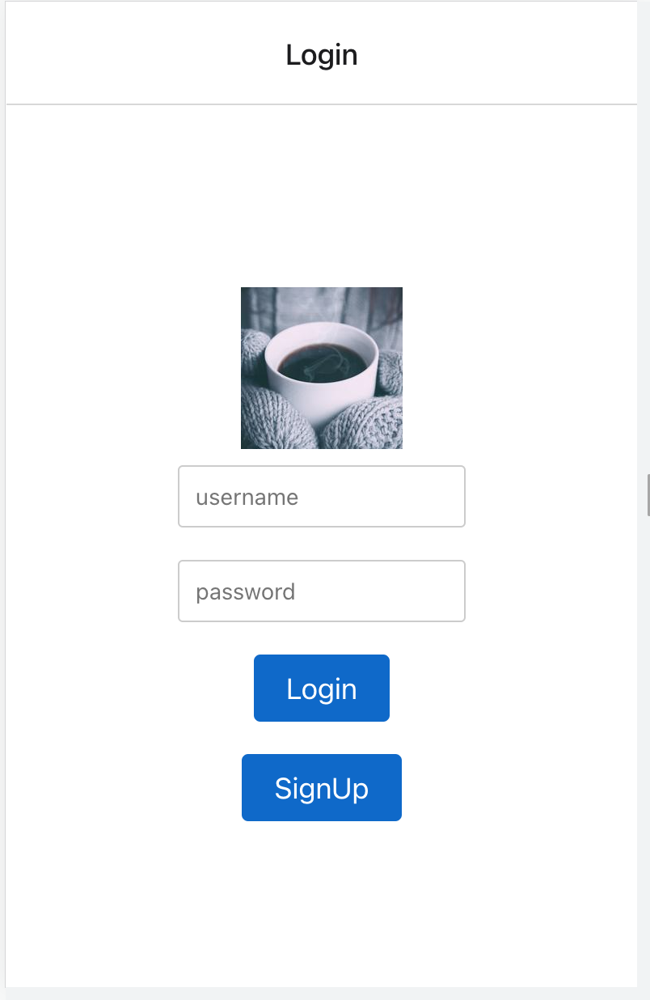
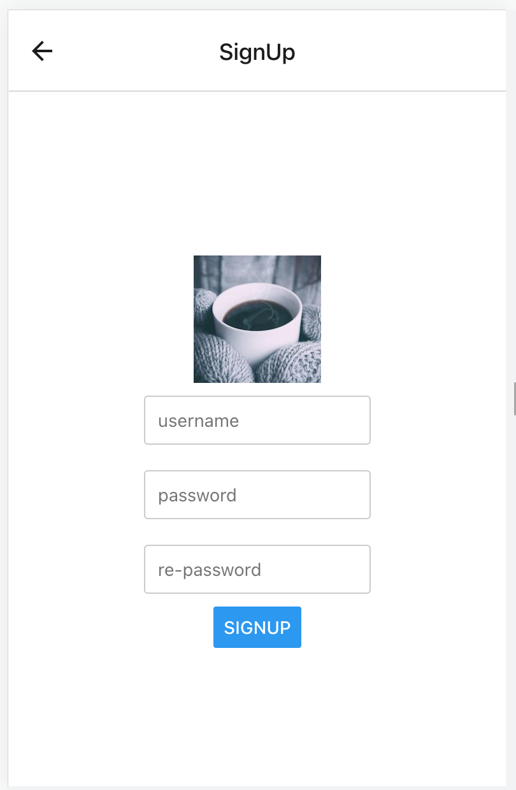
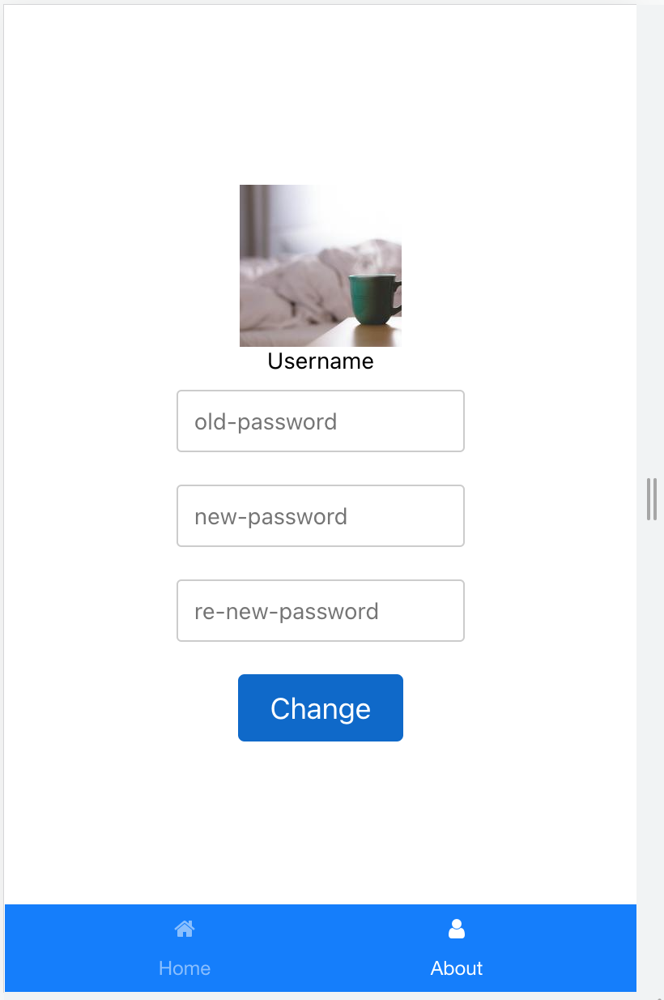

# CS571 Workshop 07 - Continue
## MIU Courses Review App
* Create the Auth part as followings:
* Login.js: which can be used to login or navigate to Signup screen. After logging in successfully, the CourseList screen will be displayed
* Signup.js: Which can be used to register a new user. Each user has 2 properties username and password. Username should be unique in the entire system. Password must be hashed when saving to database. After signing up successfully, the Login screen will be displayed
* About.js: Should show the username and Text input to change the password if users want
* Provide the backend API to support authentication and authorization
* (Optional): Add a function to create/update/delete reviews
## Notes  
* Provide simple StyleSheet object.
* Any time-consumming task (fetch...) need to have ActivitiIndicator
* Do not upload any zip files into your repo.
* Do not push any deps (node_modules).
* Remember to honor the project integrity and authenticity of your code.
* Submission deadline is 10 PM.
    
## Please find screenshots for the finished application  

  
  

